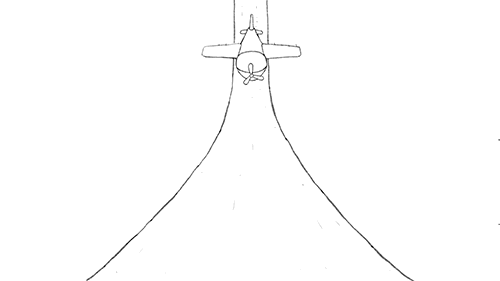
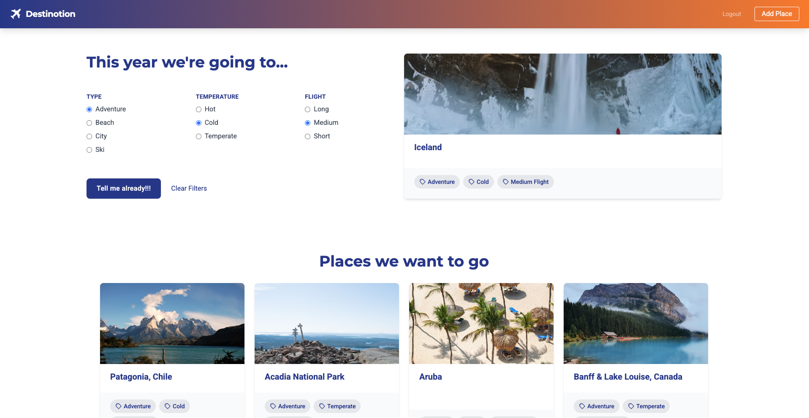
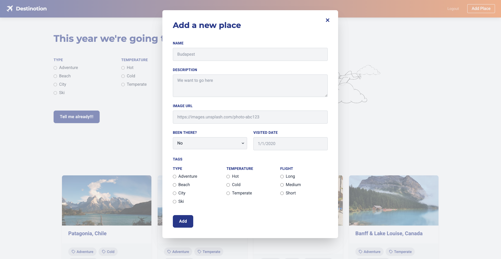
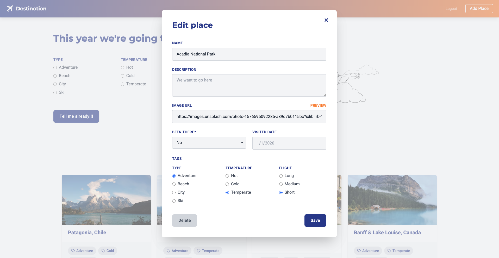

# Destinotion 🌎✈️

[**Destinotion**](https://destinotion.parthshah.co.in) is a sleek web application that helps you discover and organize your next travel adventures. Built with [Next.js](https://nextjs.org/) and [Tailwind CSS](https://tailwindcss.com/), the app offers a modern, responsive design with file-based storage to efficiently manage your travel ideas.




## Table of Contents

- [Features](#features)
- [Installation & Setup](#installation--setup)
- [Available Scripts](#available-scripts)
- [Design & Customization](#design--customization)
- [Usage Guide](#usage-guide)
- [Tech Stack](#tech-stack)
- [Performance Optimizations](#performance-optimizations)
- [Contributing](#contributing)
- [License](#license)

## Features

- **Intuitive UI:** Clean and modern design inspired by travel and adventure
- **Responsive Layout:** Mobile-friendly interface that adjusts seamlessly to different screen sizes
- **File-Based Storage:** Lightweight data management using a simple file-based database
- **Interactive Components:** Easily add, edit, and delete places with real-time updates
- **Tag Filtering:** Categorize and filter destinations by custom tags
- **Search Functionality:** Quickly find destinations by name, location, or description
- **Beautiful Animations:** Smooth transitions and micro-interactions throughout the app

## Installation & Setup

1. **Clone the Repository:**

   ```bash
   git clone https://github.com/parthshah04/Destinotion.git
   cd Destinotion
   ```

2. **Install Dependencies:**

   Using Yarn:

   ```bash
   yarn install
   ```

   Or with NPM:

   ```bash
   npm install
   ```

3. **Run the Development Server:**

   ```bash
   npm run dev
   ```

   Open [http://localhost:3000](http://localhost:3000) in your browser to view the app.

## Available Scripts

| Command | Description |
|---------|-------------|
| `npm run dev` | Starts the development server at [http://localhost:3000](http://localhost:3000) with hot-reloading |
| `npm run build` | Creates an optimized production build in the `.next` folder |
| `npm run start` | Runs the built app in production mode |

## Design & Customization

The project's design is inspired by travel and adventure. Customize the design in the following ways:

### Tailwind CSS Configuration

Update `tailwind.config.js` with custom colors, fonts, and animations:

```js
module.exports = {
  content: [
    "./pages/**/*.{js,ts,jsx,tsx}",
    "./components/**/*.{js,ts,jsx,tsx}",
  ],
  theme: {
    extend: {
      colors: {
        destinationBlue: "#1E3A8A",   // a deep blue
        destinationOrange: "#F97316", // vibrant sunset orange
        destinationSand: "#F9A826",   // warm, sandy tone
        destinationGray: "#E5E7EB",   // light gray for contrast
      },
      fontFamily: {
        sans: ['Roboto', 'sans-serif'],
        display: ['Montserrat', 'sans-serif'], // strong display font for headers
      },
      // Custom animations & keyframes
      animation: {
        fadeIn: "fadeIn 0.5s ease-in-out",
        slideUp: "slideUp 0.5s ease-in-out",
      },
      keyframes: {
        fadeIn: {
          "0%": { opacity: 0 },
          "100%": { opacity: 1 },
        },
        slideUp: {
          "0%": { transform: "translateY(20px)", opacity: 0 },
          "100%": { transform: "translateY(0)", opacity: 1 },
        },
      },
    },
  },
  plugins: [],
};
```

## Usage Guide

### Managing Destinations

1. **Add a New Destination:**
   - Click the "Add Place" button in the navigation
   - Fill in the place details including name, location, description, and tags
   - Upload an image (optional)
   - Click "Save" to add the destination to your list
  

2. **Edit a Destination:**
   - Click on the destination card to view details
   - Click the "Edit" button
   - Update the information as needed
   - Click "Save" to confirm changes
  

3. **Delete a Destination:**
   - Navigate to the destination's detail page
   - Click the "Delete" button
   - Confirm deletion in the dialog

### Filtering and Searching

- Use the tag checkboxes at the top of the destinations list to filter by category
- Use the search bar to find destinations by name, location, or description
- Combine filters and search for more specific results

## Tech Stack

- **Frontend:** React, Next.js, Tailwind CSS
- **State Management:** React Context API
- **Storage:** File-based JSON storage (easily replaceable with a database)
- **Deployment:** Vercel (recommended)

## Performance Optimizations

- **Image Optimization:** Using Next.js Image component for optimized loading
- **Code Splitting:** Automatic code splitting for faster page loads
- **Static Generation:** Pre-rendered pages where possible for SEO and performance
- **Lazy Loading:** Components and images load only when needed
- **Memoization:** Performance-critical components use React.memo and useMemo

## Contributing

Contributions are welcome and appreciated! Here's how you can contribute:

1. **Fork the Repository:** Create your own copy of the project
2. **Create a Branch:** `git checkout -b feature/your-amazing-feature`
3. **Make Changes:** Implement your feature or bug fix
4. **Run Tests:** Ensure your changes pass all tests
5. **Commit Changes:** `git commit -m 'Add some amazing feature'`
6. **Push to Branch:** `git push origin feature/your-amazing-feature`
7. **Submit a Pull Request:** Open a PR from your fork to the main repository

Please follow the project's code style and include appropriate tests for new features.

## License

This project is licensed under the [MIT License](LICENSE).

---

Made with ❤️ by [Parth Shah]